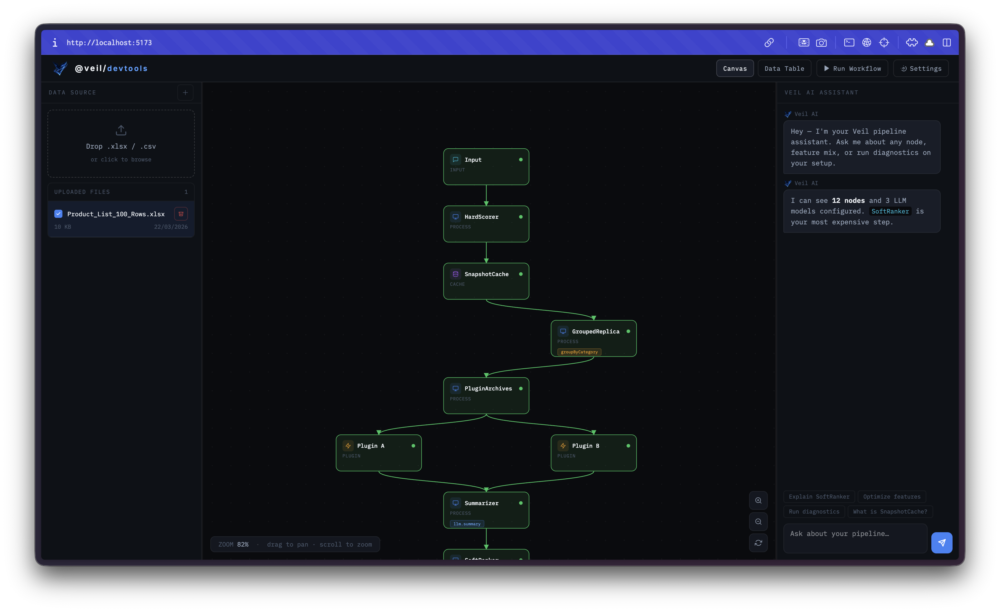

# Veil — Engine Design Spec v0.2

> Modular, adapter-based recommendation engine with an integrated AI chat interface.
> Serverless-first. No config files. Everything defined in code.

---



## Core Design Principles

| Principle | Description |
|---|---|
| **Code-first config** | No JSON/YAML files. All configuration is TypeScript — fully typed, autocompleted, refactorable |
| **Cache-first serving** | All recommendation requests are served from cache. The cycle runs in the background |
| **Hard → Soft pipeline** | Deterministic scoring first, LLM judgment second — on a small pre-ranked candidate set |
| **Caller-owned filtering** | Veil scores what it receives. Pre-filtering (expired, banned, unavailable) is the developer's responsibility |
| **Adapter-based** | Storage, LLM, queue, and every major layer is swappable without touching core logic |
| **Serverless-compatible** | Zero dependency on `fs`, `path`, `process.cwd()`, or any Node.js-only API |

---

## Package Layout

```
veil/
├── packages/
│   ├── core/                         # @veil/core
│   │
│   ├── adapters/
│   │   ├── llm/                      # @veil/llm
│   │   │   ├── openai/               #   @veil/llm/openai
│   │   │   ├── anthropic/            #   @veil/llm/anthropic
│   │   │   └── gemini/               #   @veil/llm/gemini
│   │   │
│   │   ├── storage/                  # @veil/storage
│   │   │   ├── kv/                   #   @veil/storage/kv       (Cloudflare KV)
│   │   │   ├── redis/                #   @veil/storage/redis    (Upstash HTTP)
│   │   │   ├── postgres/             #   @veil/storage/postgres (Neon / Supabase)
│   │   │   ├── sqlite/               #   @veil/storage/sqlite   (D1 / Turso HTTP)
│   │   │   ├── mongo/                #   @veil/storage/mongo    (Atlas Data API)
│   │   │   └── memory/               #   @veil/storage/memory   (dev/test)
│   │   │
│   │   └── queue/                    # @veil/queue
│   │       ├── cloudflare/           #   @veil/queue/cloudflare
│   │       ├── sqs/                  #   @veil/queue/sqs
│   │       ├── redis/                #   @veil/queue/redis      (BullMQ via Upstash)
│   │       └── inline/               #   @veil/queue/inline     (dev/test)
│   │
│   ├── plugins/
│   │   ├── web/                      # @veil/plugin-web
│   │   ├── reviews/                  # @veil/plugin-reviews
│   │   └── social/                   # @veil/plugin-social
│   │
│   └── devtools/                     # @veil/devtools
│       ├── server/                   #   Node server exposing devtools API
│       └── ui/                       #   React app — canvas dashboard
│
└── apps/
    ├── example-worker/               # Cloudflare Worker reference
    └── example-convex/               # Convex reference
```

---

## Configuration

All configuration is defined in code via `createVeil()`. There is no config file.

```ts
import {
  createBehaviorSignalPlugin,
  createLinearLearnedRanker,
  createReviewsSignalPlugin,
  createSocialSignalPlugin,
  createVeil,
} from "@veil/core";
import { openai }     from "@veil/llm/openai";
import { anthropic }  from "@veil/llm/anthropic";
import { kv }         from "@veil/storage/kv";
import { cloudflare } from "@veil/queue/cloudflare";

const veil = createVeil({

  recommendation: {
    hard: {
      categories: ["electronics", "books", "clothing"],
      features: [
        { id: "semantic", provider: "semantic-similarity", weight: 0.2, normalize: "minmax" },
        { id: "recency", provider: "freshness", weight: 0.15, normalize: "sigmoid", params: { field: "createdAt", halfLifeMs: 604800000 } },
        { id: "popularity", provider: "popularity-smoothed", weight: 0.2, normalize: "rank" },
        { id: "rating", provider: "plugin-signal", weight: 0.15, normalize: "minmax", params: { key: "reviews.avg_rating" } },
        { id: "affinity", provider: "user-affinity", weight: 0.2, normalize: "minmax", params: { type: "category" } },
        { id: "learned", provider: "learned-score", weight: 0.1, normalize: "sigmoid" },
        { id: "price", field: "price", weight: 0.15, normalize: "minmax", direction: "desc" },
      ],
      filters: [
        { field: "stock",   op: "gt", value: 0 },
        { field: "visible", op: "eq", value: true },
      ],
      policies: [
        { id: "diversity",   maxPerCategory: 3 },
        { id: "price-range", field: "price", min: 0, max: 500 },
      ],
    },

    soft: `
      You are a recommendation engine for a general-purpose e-commerce store.
      Prioritize items that are trending, highly reviewed, and match recent
      purchase patterns. Avoid near-duplicate items. Prefer category diversity
      unless the user shows strong category affinity.
    `,

    max:              200,
    cache:            true,
    autocompletion:   true,
    groupByCategory:  true,
    backgroundRefresh: "0 */6 * * *",
  },

  // ─── LLMs ───────────────────────────────────────────────────────────────────
  // Each role can use a different model independently

  llm: {
    recommendation: openai("gpt-4o"),           // soft ranking pass
    chat:           openai("gpt-4o-mini"),       // user-facing chat
    summary:        anthropic("claude-haiku-4-5"), // optional cheap model for plugin-owned jobs
  },

  // ─── Storage ─────────────────────────────────────────────────────────────────

  storage: kv({ binding: env.VEIL_KV }),

  // ─── Queue (optional) ────────────────────────────────────────────────────────

  queue: cloudflare({ binding: env.VEIL_QUEUE }),

  // ─── Chat ────────────────────────────────────────────────────────────────────

  chat: {
    enabled:  true,
    endpoint: "/api/veil/chat",
    token:    env.VEIL_CHAT_TOKEN,
  },

  // ─── Plugins ─────────────────────────────────────────────────────────────────

  plugins: [
    createBehaviorSignalPlugin(),
    createReviewsSignalPlugin(),
    createSocialSignalPlugin(),
  ],

  retrieval: {
    enabled: true,
    topK: 300,
    minScore: 0.15,
    embeddingField: "embedding",
  },

  learned: {
    ranker: createLinearLearnedRanker({
      bias: 0,
      features: [
        { key: "behavior.ctr", source: "plugin-signal", weight: 0.35 },
        { key: "reviews.avg_rating", source: "plugin-signal", weight: 0.25 },
        { key: "semantic", source: "vector-score", weight: 0.25 },
        { key: "category", source: "category-affinity", weight: 0.15 },
      ],
    }),
  },

});
```

---

## Config Type Definitions

```ts
// packages/core/src/types/config.ts

export type VeilConfig = {
  recommendation: RecommendationConfig;
  llm:            LLMRoleConfig;
  storage:        StorageAdapter;
  queue?:         QueueAdapter;
  chat?:          ChatConfig;
  plugins?:       VeilPlugin[];
  retrieval?:     RetrievalConfig;
  vector?:        VectorAdapter;
  learned?:       LearnedConfig;
  env?:           Record<string, string>;
};

// ─── LLM Roles ────────────────────────────────────────────────────────────────

export type LLMRoleConfig = {
  recommendation: VeilLanguageModel;  // soft ranking pass — use a smart model
  chat:           VeilLanguageModel;  // user-facing — can use a faster/cheaper model
  summary:        VeilLanguageModel;  // optional cheap model for plugin-owned jobs
};

// VeilLanguageModel wraps Vercel AI SDK LanguageModel
export type VeilLanguageModel = LanguageModel; // from "ai"

// ─── Recommendation ───────────────────────────────────────────────────────────

export type RecommendationConfig = {
  hard:              HardConfig;
  soft:              string;
  max?:              number;          // default: 200
  cache?:            boolean;         // default: true
  autocompletion?:   boolean;         // default: false
  groupByCategory?:  boolean;         // default: false
  backgroundRefresh?: string;         // cron string
};

export type HardConfig = {
  categories?: string[];
  features?:   HardFeatureConfig[];
  stats?:      StatsSnapshot;
  filters?:    FieldFilter[];
  policies?:   ScoringPolicy[];
};

export type HardFeatureConfig = {
  id: string;
  provider?:
    | "field"
    | "freshness"
    | "plugin-signal"
    | "semantic-similarity"
    | "user-affinity"
    | "popularity-smoothed"
    | "learned-score"
    | string;
  field?: string; // required for the built-in "field" provider
  weight: number;
  normalize?: "minmax" | "zscore" | "rank" | "sigmoid" | "none";
  direction?: "asc" | "desc";
  missingValue?: number;
  params?: Record<string, unknown>;
};

export type StatsSnapshot = Record<string, {
  min?: number;
  max?: number;
  mean?: number;
  stdDev?: number;
}>;

export type PluginSignal = {
  itemId: string;
  namespace: string;
  features: Record<string, number | string | boolean>;
  ts: number;
};

export type UserContext = {
  id?: string;
  query?: string;
  queryEmbedding?: number[];
  categoryAffinity?: Record<string, number>;
  tagAffinity?: Record<string, number>;
  itemAffinity?: Record<string, number>;
};

export type RetrievalConfig = {
  enabled?: boolean;
  topK?: number;
  minScore?: number;
  embeddingField?: string;
};

export type LearnedConfig = {
  ranker?: LearnedRanker;
};

export type FieldFilter = {
  field: string;
  op:    "eq" | "neq" | "gt" | "gte" | "lt" | "lte" | "in" | "nin";
  value: unknown;
};

export type ScoringPolicy =
  | { id: "diversity";   maxPerCategory: number }
  | { id: "price-range"; field: string; min: number; max: number }
  | { id: "boost";       field: string; value: unknown; multiplier: number }
  | { id: "penalty";     field: string; value: unknown; multiplier: number }
  | { id: "custom";      fn: (item: VeilItem) => number };

// ─── Chat ─────────────────────────────────────────────────────────────────────

export type ChatConfig = {
  enabled:  boolean;
  endpoint: string;
  token:    string;
};
```

---

## LLM Adapters

Each adapter follows the same interface and wraps the Vercel AI SDK `LanguageModel`.

```ts
// @veil/llm/openai
import { createOpenAI } from "@ai-sdk/openai";

export function openai(
  model: string,
  options?: { apiKey?: string; baseUrl?: string }
): VeilLanguageModel {
  const provider = createOpenAI({ apiKey: options?.apiKey, baseURL: options?.baseUrl });
  return provider(model);
}

// @veil/llm/anthropic
import { createAnthropic } from "@ai-sdk/anthropic";

export function anthropic(
  model: string,
  options?: { apiKey?: string }
): VeilLanguageModel {
  const provider = createAnthropic({ apiKey: options?.apiKey });
  return provider(model);
}

// @veil/llm/gemini
import { createGoogleGenerativeAI } from "@ai-sdk/google";

export function gemini(
  model: string,
  options?: { apiKey?: string }
): VeilLanguageModel {
  const provider = createGoogleGenerativeAI({ apiKey: options?.apiKey });
  return provider(model);
}
```

Usage — each role independently configured:

```ts
llm: {
  recommendation: openai("gpt-4o",                    { apiKey: env.OPENAI_KEY }),
  chat:           gemini("gemini-1.5-flash",           { apiKey: env.GEMINI_KEY }),
  summary:        anthropic("claude-haiku-4-5", { apiKey: env.ANTHROPIC_KEY }),
}
```

---

## Storage Adapters

All adapters are HTTP-based — no persistent TCP connections, safe for serverless.

```ts
// packages/core/src/types/adapters.ts

export type StorageAdapter = {
  get:    (key: string) => Promise<string | null>;
  set:    (key: string, value: string, ttl?: number) => Promise<void>;
  delete: (key: string) => Promise<void>;
  list:   (prefix: string) => Promise<string[]>;
};
```

```ts
// @veil/storage/kv — Cloudflare KV
export function kv(options: { binding: KVNamespace }): StorageAdapter;

// @veil/storage/redis — Upstash Redis (HTTP, serverless-safe)
export function redis(options: { url: string; token: string }): StorageAdapter;

// @veil/storage/postgres — Neon / Supabase via HTTP client
export function postgres(options: { connectionString: string }): StorageAdapter;

// @veil/storage/sqlite — Cloudflare D1 or Turso via HTTP
export function sqlite(options: {
  binding?: D1Database;     // D1
  url?: string;             // Turso HTTP URL
  token?: string;
}): StorageAdapter;

// @veil/storage/mongo — MongoDB Atlas Data API (HTTP)
export function mongo(options: {
  dataApiUrl:  string;
  apiKey:      string;
  database:    string;
  collection:  string;
}): StorageAdapter;

// @veil/storage/memory — in-memory, dev/test only
export function memory(): StorageAdapter;
```

---

## Queue Adapters

```ts
export type QueueAdapter = {
  enqueue: (message: QueueMessage) => Promise<void>;
  batch:   (messages: QueueMessage[]) => Promise<void>;
};

// @veil/queue/cloudflare
export function cloudflare(options: { binding: Queue }): QueueAdapter;

// @veil/queue/sqs
export function sqs(options: { queueUrl: string; region: string }): QueueAdapter;

// @veil/queue/redis — BullMQ via Upstash HTTP
export function redis(options: { url: string; token: string }): QueueAdapter;

// @veil/queue/inline — synchronous, no external queue — dev/test
export function inline(): QueueAdapter;
```

---

## Core Item Types

```ts
// packages/core/src/types/item.ts

// Full item — what the developer passes into the recommendation cycle
export type VeilItem = {
  id:       string;
  name:     string;
  category: string;
  tags?:    string[];
  [key: string]: unknown;
};

// Compact item — lives in cache, used in LLM context
// Token-efficient: no descriptions, no long strings
export type VeilCacheItem = {
  id:         string;
  name:       string;
  category:   string;
  hard_score: number;
  tags?:      string[];
  meta?:      Record<string, string | number | boolean>;
};

// LLM-ranked item — output of soft pass, stored in final cache
export type VeilRankedItem = {
  id:         string;
  name:       string;
  category:   string;
  hard_score: number;
  llm_score:  number;
  rank:       number;
  tags?:      string[];
  meta?:      Record<string, string | number | boolean>;
  reasoning:  string;
};

// Lightweight item served to chat context and serve-time filters
export type VeilChatItem = {
  id:       string;
  name:     string;
  category: string;
  rank:     number;
  tags?:    string[];
  meta?:    Record<string, string | number | boolean>;
};

export type VeilFeedback = {
  itemId: string;
  event:  "view" | "click" | "purchase" | "skip" | "dwell" | "dislike";
  score:  number;
  ts:     number;
  meta?:  Record<string, unknown>;
};
```

---

## Recommendation Cycle

```
Developer passes pre-filtered items
              │
              ▼
    ┌──────────────────────┐
    │  Step 1              │  Candidate Retrieval
    │  Retriever           │  semantic/vector topK + minScore + fallback pass-through
    └──────────┬───────────┘  → candidate items
               │
               ▼
    ┌──────────────────────┐
    │  Step 2              │  Plugin Signals
    │  SignalCollector     │  collectSignals() → aggregated per-item signal snapshot
    └──────────┬───────────┘  key: "snapshot:signals"
               │
               ▼
    ┌──────────────────────┐
    │  Step 3              │  Hard Scoring
    │  HardScorer          │  semantic + user affinity + smoothed behavior + learned score
    └──────────┬───────────┘  → VeilCacheItem[] sorted by hard_score
               │
               ▼
    ┌──────────────────────┐
    │  Step 4              │  LLM Soft Pass  [llm.recommendation]
    │  SoftRanker          │  Context bundle → LLM → ranked decisions
    └──────────┬───────────┘  → VeilRankedItem[]
               │
               ▼
    ┌──────────────────────┐
    │  Step 5              │  Final Cache Write
    │  CacheWriter         │  key: "snapshot:ranked"  (full, for recommendations)
    └──────────────────────┘  key: "snapshot:chat"    (slim, for chat context)
```

### Step 1 — Hard Scoring

```ts
// packages/core/src/scoring/hard.ts

export function hardScore(items: VeilItem[], config: HardConfig): VeilCacheItem[] {
  const filtered = applyHardFilters(items, config);
  const scored   = scoreItems(filtered, config);
  const adjusted = applyPolicies(scored, config.policies ?? []);
  return adjusted.sort((a, b) => b.hard_score - a.hard_score);
}

function scoreItems(items: VeilItem[], config: HardConfig): VeilCacheItem[] {
  const features = config.features ?? [];
  const featureSets = features.map(feature => {
    const rawValues = items.map(item => readFeatureValue(item, feature)); // field, freshness, plugin-signal
    const stats = buildFeatureStats(rawValues, config.stats?.[feature.id]); // plus plugin signal stats
    return { feature, rawValues, stats };
  });

  return items.map((item, index) => ({
    ...toCacheItem(item),
    hard_score: featureSets.reduce((acc, featureSet) => {
      const value = normalizeFeatureValue(
        featureSet.rawValues[index],
        featureSet.feature,
        featureSet.stats,
        featureSet.rawValues,
      );
      return acc + value * featureSet.feature.weight;
    }, 0),
  }));
}

function toCacheItem(item: VeilItem): Omit<VeilCacheItem, "hard_score"> {
  const { id, name, category, tags, ...rest } = item;
  return { id, name, category, tags, meta: extractSlimMeta(rest) };
}
```

Built-in providers now include:

- `field`: reads a numeric field directly from the item
- `freshness`: computes exponential recency decay from a timestamp field
- `plugin-signal`: reads an aggregated numeric plugin feature such as `reviews.avg_rating` or `social.trend_score`
- `semantic-similarity`: reads vector similarity from retrieval/vector scoring
- `user-affinity`: reads user category, tag, or item affinity
- `popularity-smoothed`: applies behavioral smoothing over views, clicks, and purchases
- `learned-score`: merges a learned-ranker output into deterministic hard scoring

### Step 0 — Candidate Retrieval

```ts
// packages/core/src/scoring/retrieval.ts

export async function retrieveCandidates(args: {
  items: VeilItem[];
  retrieval?: RetrievalConfig;
  vector?: VectorAdapter;
  user?: UserContext;
}): Promise<CandidateRetrievalResult> {
  // vector topK retrieval when queryEmbedding exists
  // otherwise pass through all items
}
```

### Step 1a — Plugin Signal Aggregation

```ts
// packages/core/src/scoring/signals.ts

export async function collectPluginSignals(args: {
  items: VeilItem[];
  plugins?: VeilPlugin[];
  storage: StorageAdapter;
  llm: LLMRoleConfig;
}): Promise<PluginSignal[]> {
  const signals = await Promise.all(
    (args.plugins ?? []).map(async (plugin) => {
      if (!plugin.collectSignals) return [];
      return plugin.collectSignals({
        items: args.items,
        storage: args.storage,
        llm: args.llm,
      });
    }),
  );

  return signals.flat();
}

export function buildPluginSignalSnapshot(signals: PluginSignal[]): PluginSignalSnapshot {
  // latest numeric value wins per item + namespace.key
  // also computes StatsSnapshot for plugin-backed features
}
```

### Step 2a — Learned Rank Signals

```ts
// packages/core/src/scoring/learned.ts

const ranker = createLinearLearnedRanker({
  bias: 0,
  features: [
    { key: "behavior.ctr", source: "plugin-signal", weight: 0.35 },
    { key: "reviews.avg_rating", source: "plugin-signal", weight: 0.25 },
    { key: "semantic", source: "vector-score", weight: 0.25 },
    { key: "category", source: "category-affinity", weight: 0.15 },
  ],
});
```

### Step 3 — LLM Soft Pass

```ts
// packages/core/src/scoring/soft.ts

export async function softRank(
  snapshot: VeilCacheItem[],
  config: Pick<VeilConfig, "recommendation" | "llm">,
  feedback: VeilFeedback[],
): Promise<VeilRankedItem[]> {
  const candidates = snapshot.slice(0, config.recommendation.max ?? 200);

  const { object } = await generateObject({
    model: config.llm.recommendation,
    schema: SoftRankingSchema,
    system: SOFT_RANK_SYSTEM_PROMPT,
    prompt: buildSoftContext({ candidates, config, feedback }),
  });

  return mergeRankings(candidates, object.rankings);
}

// Compact single-line format — minimizes token usage
// "prod_123 | Nike Air Max 90 | sneakers | score:0.87 | tags:trending,sale | price:119"
function formatCandidateLine(item: VeilCacheItem): string {
  const tags = item.tags?.join(",") ?? "";
  const meta = Object.entries(item.meta ?? {}).map(([k, v]) => `${k}:${v}`).join(" ");
  return `${item.id} | ${item.name} | ${item.category} | score:${item.hard_score.toFixed(2)} | tags:${tags} ${meta}`.trim();
}
```

---

## Serving Layer

Two options. Developers choose one or combine both.

### Option A — Raw Snapshot (Developer Filters)

Veil returns the full ranked snapshot. The developer applies user-level filtering in their own application code.

```ts
// Get the full universal ranked list
const snapshot = await veil.recommend.get();

// Developer applies their own serving logic
const forUser = snapshot
  .filter(item => item.meta?.region === user.region)
  .filter(item => (item.meta?.price as number) <= user.budget)
  .filter(item => !user.purchasedIds.includes(item.id))
  .slice(0, 10);
```

Use this when your filtering logic is complex, combines multiple data sources outside Veil, or you need full control over how the snapshot is consumed.

### Option B — Serve-Time Filter API (Veil Filters)

Pass user context to Veil at serve time. Veil filters and slices the cached snapshot for you. Entirely cache-based — no LLM call, no re-scoring. The universal ranking order is preserved; only visibility is affected.

```ts
const items = await veil.recommend.get({
  limit:    10,
  filter: {
    // Exact match
    match: {
      "meta.region": user.region,
      "meta.currency": user.currency,
    },

    // Numeric range
    range: {
      "meta.price": { min: 0, max: user.budget },
      "meta.rating": { min: 3.5 },
    },

    // Category allowlist / blocklist
    categories: {
      include: user.preferredCategories,   // optional
      exclude: user.blockedCategories,     // optional
    },

    // Tag-based filtering
    tags: {
      include: ["available"],
      exclude: ["adult-only"],
    },

    // Item ID blocklist — e.g. already purchased
    blocklist: user.purchasedIds,

    // Free custom filter function (runs in-memory over the snapshot)
    custom: (item: VeilRankedItem) => item.meta?.launchDate < user.signupTs,
  },
});
```

### Filter Type Definition

```ts
// packages/core/src/types/serve.ts

export type ServeOptions = {
  limit?: number;
  offset?: number;
  filter?: ServeFilter;
};

export type ServeFilter = {
  match?:      Record<string, unknown>;
  range?:      Record<string, { min?: number; max?: number }>;
  categories?: { include?: string[]; exclude?: string[] };
  tags?:       { include?: string[]; exclude?: string[] };
  blocklist?:  string[];
  custom?:     (item: VeilRankedItem) => boolean;
};
```

### Internal Filter Execution

```ts
// packages/core/src/api/recommend.ts

export async function getRecommendations(
  storage: StorageAdapter,
  options?: ServeOptions,
): Promise<VeilRankedItem[]> {
  const raw = await storage.get("snapshot:ranked");
  if (!raw) return [];

  let items = JSON.parse(raw) as VeilRankedItem[];

  if (options?.filter) {
    items = applyServeFilter(items, options.filter);
  }

  const offset = options?.offset ?? 0;
  const limit  = options?.limit  ?? items.length;
  return items.slice(offset, offset + limit);
}

function applyServeFilter(items: VeilRankedItem[], filter: ServeFilter): VeilRankedItem[] {
  return items.filter(item => {
    if (filter.match) {
      for (const [path, value] of Object.entries(filter.match)) {
        if (getPath(item, path) !== value) return false;
      }
    }

    if (filter.range) {
      for (const [path, bounds] of Object.entries(filter.range)) {
        const val = getPath(item, path) as number;
        if (bounds.min !== undefined && val < bounds.min) return false;
        if (bounds.max !== undefined && val > bounds.max) return false;
      }
    }

    if (filter.categories) {
      const { include, exclude } = filter.categories;
      if (include?.length && !include.includes(item.category)) return false;
      if (exclude?.length &&  exclude.includes(item.category)) return false;
    }

    if (filter.tags) {
      const { include, exclude } = filter.tags;
      const itemTags = item.tags ?? [];
      if (include?.length && !include.some(t => itemTags.includes(t))) return false;
      if (exclude?.length &&  exclude.some(t => itemTags.includes(t))) return false;
    }

    if (filter.blocklist?.includes(item.id)) return false;
    if (filter.custom && !filter.custom(item)) return false;

    return true;
  });
}
```

### Combining Both Options

```ts
// Grab the raw snapshot once, run multiple filters client-side
const snapshot = await veil.recommend.get();

// Surface A — homepage feed
const feed = veil.recommend.filter(snapshot, {
  filter: { categories: { include: ["electronics"] }, range: { "meta.price": { max: 300 } } },
  limit: 12,
});

// Surface B — sidebar widget
const sidebar = veil.recommend.filter(snapshot, {
  filter: { tags: { include: ["trending"] }, blocklist: user.purchasedIds },
  limit: 5,
});
```

`veil.recommend.filter()` is a pure in-memory function — it accepts a pre-fetched snapshot and a filter, and returns a filtered list. No async, no storage calls.

---

## Plugin System

```ts
// packages/core/src/types/plugin.ts

export type VeilPlugin = {
  id:       string;
  version:  string;

  collectSignals?: (ctx: PluginSignalContext) => Promise<PluginSignal[]>;
};

export type PluginSignalContext = {
  items: VeilItem[];
  storage: StorageAdapter;
  llm:     LLMRoleConfig;
  env?:    Record<string, string>;
};

export type PluginSignal = {
  itemId: string;
  namespace: string;
  features: Record<string, number | string | boolean>;
  ts: number;
};
```

Example:

```ts
const plugins = [
  createBehaviorSignalPlugin(),
  createReviewsSignalPlugin(),
  createSocialSignalPlugin(),
];
```

These built-ins emit usable signals immediately:

- `createBehaviorSignalPlugin()`: `behavior.views`, `behavior.clicks`, `behavior.purchases`, `behavior.ctr`, `behavior.cvr`
- `createReviewsSignalPlugin()`: `reviews.avg_rating`, `reviews.review_count`, `reviews.rating_velocity`
- `createSocialSignalPlugin()`: `social.mention_count`, `social.sentiment_score`, `social.trend_score`

---

## Chat Interface

Uses `llm.chat` model. Operates against `snapshot:chat` — the lightweight ranked index.

```ts
// packages/core/src/chat/handler.ts

export async function handleChatRequest(
  request: Request,
  veil: VeilInstance,
): Promise<Response> {
  const token = request.headers.get("Authorization")?.replace("Bearer ", "");
  if (token !== veil.config.chat?.token) {
    return new Response("Unauthorized", { status: 401 });
  }

  const { messages } = await request.json();

  const raw   = await veil.storage.get("snapshot:chat");
  const items = raw ? (JSON.parse(raw) as VeilChatItem[]) : [];

  const result = streamText({
    model:    veil.config.llm.chat,    // uses llm.chat role
    system:   buildChatSystemPrompt(items),
    messages,
    tools:    buildChatTools(veil.plugins),
  });

  return result.toDataStreamResponse();
}
```

---

## Cache Key Schema

```
snapshot:hard                         full hard-scored VeilCacheItem[]
snapshot:hard:category:{name}         grouped replica (if groupByCategory)
snapshot:signals                      aggregated plugin signal snapshot + stats
snapshot:retrieval                    retrieval result + vector scores
snapshot:ranked                       LLM-ranked VeilRankedItem[] — recommendation serving
snapshot:chat                         slim VeilChatItem[] — chat context
snapshot:meta                         { ranAt, duration, itemCount, pluginCount, signalCount, retrievedCount, model }

autocompletion:index                  prefix search token index
```

---

## `veil.cycle` API

```ts
// Full cycle — collect plugin signals + hard score + soft rank
await veil.cycle.run(items);

// Partial runs
await veil.cycle.runHard(items);       // hard scoring only, no LLM
await veil.cycle.runSoft();            // soft pass only, uses existing hard snapshot

// Inspection
const meta = await veil.cycle.meta();
// { ranAt: 1710000000, durationMs: 4200, itemCount: 8400, pluginCount: 3, signalCount: 12600, model: "gpt-4o" }
```

---

## DevTools (`@veil/devtools`)

A local React dashboard for inspecting, debugging, and simulating the Veil engine. Enabled only in development — zero footprint in production.

### Starting DevTools

```ts
// dev-server.ts (local only — never imported in your Worker/Lambda)
import { startDevtools } from "@veil/devtools/server";
import { veil } from "./my-veil";

startDevtools({ veil, port: 4242 });
// → http://localhost:4242
```

### UI Structure

The DevTools UI is a single React app with three panels:

```
┌─────────────────────────────────────────────────────────────────┐
│  Veil DevTools                                    v0.1.0   ⚙    │
├──────────────┬──────────────────────────────────────────────────┤
│              │                                                   │
│  NODES       │                                                   │
│              │                                                   │
│  ○ Input     │         [ Live Canvas — Node Graph ]             │
│  ○ HardScore │                                                   │
│  ○ Cache     │    Input ──► HardScorer ──► Cache                │
│  ○ Plugins   │                  │                               │
│  ○ Summarize │              Plugins ──► Summarizer              │
│  ○ SoftRank  │                  │                               │
│  ○ FinalCache│             SoftRanker ──► FinalCache            │
│  ○ Chat      │                                                   │
│              │                                                   │
├──────────────┴──────────────────────────────────────────────────┤
│  INSPECTOR                        SIMULATION                     │
│  Node: SoftRanker                 [▶ Run Cycle]  [Run Hard Only]│
│  Status: idle                     Items: [paste or upload JSON] │
│  Last ran: 2h ago                 Filter: { region: "BD" }      │
│  Duration: 1.2s                   Model override: [gpt-4o-mini] │
│  Items in: 200                    [Run Simulation]              │
│  Items out: 200                                                  │
│  Model: gpt-4o                    Last result: 12 items served  │
└─────────────────────────────────────────────────────────────────┘
```

### Canvas Node Graph

Each step of the recommendation cycle is a **node**. Edges represent data flow. When the cycle runs — live or simulated — nodes animate sequentially:

- **Idle** — grey outline, no animation
- **Active** — blue pulse, animated edge flow towards next node
- **Complete** — green fill, edge locked
- **Error** — red fill, error detail on hover

Nodes:

```
[Input] ──► [Retriever] ──► [SignalCollector] ──► [HardScorer] ──► [SnapshotCache]
                                    │
                              [GroupedReplica]  (shown only if groupByCategory: true)
                                                                       │
                                                                 [SoftRanker]  (llm.recommendation model shown on node)
                    │
              [FinalCache]
              ┌─────┴──────┐
        [snapshot:ranked]  [snapshot:chat]
```

### Settings Panel

Exposed via the ⚙ icon. Allows live editing of:

```ts
type DevtoolsSettings = {
  simulation: {
    itemsJson:     string;     // paste raw items array
    filterOptions: ServeOptions;
    modelOverride: {
      recommendation?: string;
      chat?:           string;
      summary?:        string;
    };
  };
  display: {
    animationSpeed: "slow" | "normal" | "fast";
    showTokenCounts: boolean;
    showLatency:     boolean;
  };
};
```

### DevTools Server API

The React UI talks to a local API server that bridges to the live Veil instance:

```
GET  /api/devtools/status         — current cycle status and cached metadata
GET  /api/devtools/snapshot       — current ranked snapshot
GET  /api/devtools/plugins        — plugin list
GET  /api/devtools/adapters       — active adapter kinds (storage/queue)
POST /api/devtools/cycle/run      — trigger a full cycle
POST /api/devtools/cycle/hard     — trigger hard scoring only
POST /api/devtools/cycle/soft     — trigger soft pass only
POST /api/devtools/simulate       — run a simulation with custom items + filter
POST /api/devtools/uploads        — upload a dataset file (xlsx/csv) to storage
GET  /api/devtools/uploads        — list uploaded dataset files
GET  /api/devtools/stream         — SSE stream of live cycle events for canvas animation
```

---

## Serverless Deployment

### Cloudflare Worker

```ts
// worker.ts
import { createVeil } from "@veil/core";
import { openai }     from "@veil/llm/openai";
import { anthropic }  from "@veil/llm/anthropic";
import { kv }         from "@veil/storage/kv";
import { cloudflare } from "@veil/queue/cloudflare";
import { webPlugin }  from "@veil/plugin-web";

export default {
  async fetch(request: Request, env: Env): Promise<Response> {
    const veil = createVeil({
      recommendation: { ... },
      llm: {
        recommendation: openai("gpt-4o",         { apiKey: env.OPENAI_KEY }),
        chat:           openai("gpt-4o-mini",     { apiKey: env.OPENAI_KEY }),
        summary:        anthropic("claude-haiku-4-5", { apiKey: env.ANTHROPIC_KEY }),
      },
      storage: kv({ binding: env.VEIL_KV }),
      queue:   cloudflare({ binding: env.VEIL_QUEUE }),
      chat:    { enabled: true, endpoint: "/api/veil/chat", token: env.VEIL_TOKEN },
      plugins: [webPlugin({ endpoint: "/api/veil/collect", events: ["view", "click"] })],
    });

    const url = new URL(request.url);

    if (url.pathname === "/api/veil/chat")    return veil.chat.handle(request);
    if (url.pathname === "/api/veil/collect") return veil.plugins.handle(request);

    if (url.pathname === "/api/recommend") {
      const items = await veil.recommend.get({
        limit:  10,
        filter: {
          match: { "meta.region": request.headers.get("CF-IPCountry") },
          range: { "meta.price": { max: 300 } },
        },
      });
      return Response.json(items);
    }

    return new Response("Not Found", { status: 404 });
  },

  async scheduled(event: ScheduledEvent, env: Env): Promise<void> {
    const veil  = createVeil({ ... });
    const items = await fetchYourItems(env);
    await veil.cycle.run(items);
  },

  async queue(batch: MessageBatch, env: Env): Promise<void> {
    const veil = createVeil({ ... });
    await veil.queue.process(batch.messages);
  },
};
```

### Convex

```ts
// convex/veil.ts
import { createVeil }  from "@veil/core";
import { openai }      from "@veil/llm/openai";
import { redis }       from "@veil/storage/redis";
import { inline }      from "@veil/queue/inline";
import { internalAction, internalMutation } from "./_generated/server";

function makeVeil(env: Record<string, string>) {
  return createVeil({
    recommendation: { ... },
    llm: {
      recommendation: openai("gpt-4o",     { apiKey: env.OPENAI_KEY }),
      chat:           openai("gpt-4o-mini", { apiKey: env.OPENAI_KEY }),
      summary:        openai("gpt-4o-mini", { apiKey: env.OPENAI_KEY }),
    },
    storage: redis({ url: env.UPSTASH_URL, token: env.UPSTASH_TOKEN }),
    queue:   inline(),
  });
}

// Scheduled cycle — runs via Convex cron
export const runCycle = internalAction(async (ctx) => {
  const env  = await ctx.runQuery(internal.config.getEnv);
  const veil = makeVeil(env);
  const items = await ctx.runQuery(internal.items.listActive);
  await veil.cycle.run(items);
});

// Recommendation query
export const getRecommendations = internalAction(async (ctx, args: {
  region:   string;
  budget:   number;
  userId:   string;
}) => {
  const env  = await ctx.runQuery(internal.config.getEnv);
  const veil = makeVeil(env);
  return veil.recommend.get({
    limit:  20,
    filter: {
      match:    { "meta.region": args.region },
      range:    { "meta.price": { max: args.budget } },
      blocklist: await ctx.runQuery(internal.orders.getPurchasedIds, { userId: args.userId }),
    },
  });
});
```

---

## Sub-Veils (3rd-Party Extensions)

```ts
// npm: veil-sub-shopify
import { defineSubVeil } from "@veil/core";

export function shopifyVeil(options: ShopifyOptions) {
  return defineSubVeil({
    recommendation: {
      hard: {
        features: [
          { id: "popularity", field: "popularity", weight: 0.4, normalize: "rank" },
          { id: "rating", field: "rating", weight: 0.3, normalize: "minmax" },
          { id: "recency", field: "recency", weight: 0.2, normalize: "minmax" },
          { id: "price", field: "price", weight: 0.1, normalize: "minmax", direction: "desc" },
        ],
        filters:  [{ field: "status", op: "eq", value: "active" }],
        policies: [{ id: "diversity", maxPerCategory: 4 }],
      },
      soft: `
        You are a recommendation engine for a Shopify store.
        Favor items with strong sales history and positive reviews.
        Avoid out-of-season items unless on promotion.
      `,
    },
    plugins: [
      shopifyWebPlugin(options),
      shopifyReviewsPlugin(options),
    ],
  });
}

// Consuming it
const veil = createVeil({
  ...shopifyVeil({ shopDomain: env.SHOP_DOMAIN, accessToken: env.SHOPIFY_TOKEN }),
  llm: {
    recommendation: openai("gpt-4o",     { apiKey: env.OPENAI_KEY }),
    chat:           openai("gpt-4o-mini", { apiKey: env.OPENAI_KEY }),
    summary:        openai("gpt-4o-mini", { apiKey: env.OPENAI_KEY }),
  },
  storage: kv({ binding: env.VEIL_KV }),
});
```

---

## Summary

```
createVeil(config)
    │
    ├── recommendation
    │     ├── hard         → filters, feature providers, plugin signals, user context, learned score → hard_score per item
    │     ├── soft         → natural language prompt → LLM re-ranks top `max` items
    │     ├── cache        → snapshot:retrieval, snapshot:signals, snapshot:hard, snapshot:ranked, snapshot:chat
    │     └── cycle        → scheduled or on-demand, always background
    │
    ├── llm
    │     ├── recommendation  → smart model — soft ranking pass
    │     ├── chat            → fast model  — user-facing chat
    │     └── summary         → optional cheap model — plugin-owned jobs
    │
    ├── storage          → single adapter: KV / Redis / Postgres / SQLite / Mongo / Memory
    │
    ├── queue            → optional: CF Queue / SQS / Redis / Inline
    │
    ├── retrieval        → candidate topK selection using vectors / in-memory cosine / custom retriever
    │
    ├── vector           → optional adapter providing semantic similarity scores
    │
    ├── learned          → optional learned ranker merged into hard scoring
    │
    ├── chat             → streamText against snapshot:chat [llm.chat]
    │
    ├── recommend
    │     ├── get(options?)        → Option A: raw snapshot
    │     │                          Option B: serve-time filtered snapshot
    │     └── filter(snap, opts)   → pure in-memory filter, no async
    │
    └── plugins[]
          └── collectSignals()         → per-item numeric signals consumed by retrieval + hard scoring
```
